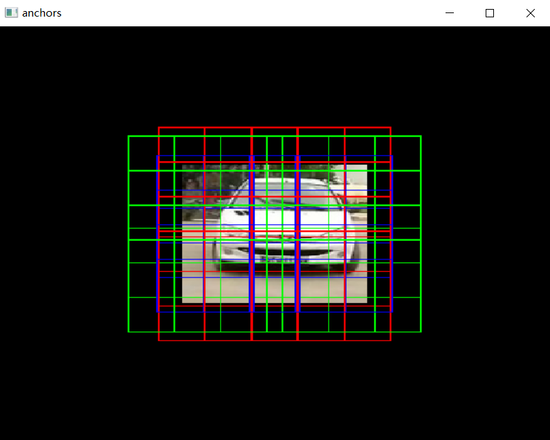

# Single-scale SSD-like network for Single Object Localization

## Task and Dataset Info
>- Object localization using CNN 
>- Data: In each image, there is just one object. We just need to localize the only object in the image. If you are interested in multi-object detection(object detection field),you can modify my code to reach your goal.
>- Evaluation metric: A correct localization means the predict class label is correct and the predict box has an loU>0.5 with the ground- truth. 
>- implementing the localization network using direct bbox regression 

**Because this is an experiment of 《Foundation of Computer Vision》class which is hosted by Prof.Xinggang Wang and Prof.Zhenyu Liao in Huazhong University of Science and Technology.** So I am not sure whether I have the privilege to make the dataset open source. Whatever, if there is any question, please contact on me! I will pull it at soon.

## dataset is shown in the .zip file
You can read the README.md in the .zip file after unpacking it!

## anchors 
Our anchors are generated by **K Means Cluster Algorithm** and fully cover every point in the feature map, which is proposed in YOLOv2.

As for the label assignment, I just imitate the **SSD Match Stategy** which is mentioned in SSD paper.

## Loss
I just imitate the SSD Loss, which used **Hard Negative Sampling**.

## Reference
1. [SSD paper](https://arxiv.org/abs/1512.02325)

2. torchvision SSD source code which is shown in [https://pytorch.org/](https://pytorch.org/)

3. [Blog of Torchvision SSD](https://zhuanlan.zhihu.com/p/441101447)

4. [YOLOv2 paper](https://openaccess.thecvf.com/content_cvpr_2017/papers/Redmon_YOLO9000_Better_Faster_CVPR_2017_paper.pdf)
